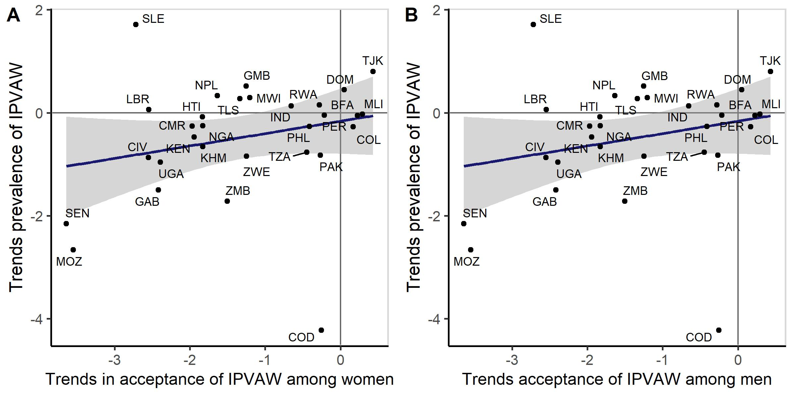

# Methods


```
## # A tibble: 1 × 2
##   `min(year)` `max(year)`
##   <chr>       <chr>      
## 1 1999        2022
```

```
## # A tibble: 1 × 2
##   `sum(n_both)` `n_distinct(country)`
##           <int>                 <int>
## 1       1809436                    69
```

```
## # A tibble: 1 × 2
##   `sum(n_men)` `n_distinct(country)`
##          <int>                 <int>
## 1       509494                    60
```


# Results

## A Global Decline in IPVAW


```
## # A tibble: 3 × 8
##   measure                         n   neg `neg/n`   mean    se   lower  upper
##   <fct>                       <int> <int>   <dbl>  <dbl> <dbl>   <dbl>  <dbl>
## 1 Prevalence of IPVAW            31    21   0.677 -0.457 0.202 -0.0603 -0.854
## 2 Women’s acceptance of IPVAW    46    42   0.913 -1.32  0.148 -1.03   -1.61 
## 3 Men’s acceptance of IPVAW      36    32   0.889 -1.40  0.177 -1.05   -1.75
```


<div class="figure" style="text-align: center">

<p class="caption">Figure 1. Estimated time trends, in percentage points per year, for (A) the prevalence of IPVAW in 31 countries, (B) women’s acceptance of IPVAW in 46 countries, and (C) men’s</p>
</div>


#### Compare before and after Pierotti


```
## # A tibble: 2 × 8
##   period             n   neg `neg/n`   mean    se  lower upper
##   <chr>          <int> <int>   <dbl>  <dbl> <dbl>  <dbl> <dbl>
## 1 after pierotti    21    18   0.857 -0.968 0.201 -0.574 -1.36
## 2 pierotti          21    19   0.905 -1.82  0.366 -1.11  -2.54
```


## Between-Operationalization Consistency of Trends
### Consistency across  items

<table class=" lightable-classic" style='font-family: "Arial Narrow", "Source Sans Pro", sans-serif; width: auto !important; margin-left: auto; margin-right: auto;'>
<caption>Table 1. Correlation table showing consistency in time trends per country in women’s acceptance of intimate partner violence across contexts.</caption>
 <thead>
  <tr>
   <th style="text-align:left;">   </th>
   <th style="text-align:left;"> beat_argues </th>
   <th style="text-align:left;"> beat_burn_food </th>
   <th style="text-align:left;"> beat_chld_negl </th>
   <th style="text-align:left;"> beat_go_out </th>
   <th style="text-align:left;"> beat_refuse_sex </th>
  </tr>
 </thead>
<tbody>
  <tr>
   <td style="text-align:left;"> beat_argues </td>
   <td style="text-align:left;"> -0.7 </td>
   <td style="text-align:left;">  </td>
   <td style="text-align:left;">  </td>
   <td style="text-align:left;">  </td>
   <td style="text-align:left;">  </td>
  </tr>
  <tr>
   <td style="text-align:left;"> beat_burn_food </td>
   <td style="text-align:left;"> 0.53 </td>
   <td style="text-align:left;"> -0.65 </td>
   <td style="text-align:left;">  </td>
   <td style="text-align:left;">  </td>
   <td style="text-align:left;">  </td>
  </tr>
  <tr>
   <td style="text-align:left;"> beat_chld_negl </td>
   <td style="text-align:left;"> 0.7 </td>
   <td style="text-align:left;"> 0.76 </td>
   <td style="text-align:left;"> -1.15 </td>
   <td style="text-align:left;">  </td>
   <td style="text-align:left;">  </td>
  </tr>
  <tr>
   <td style="text-align:left;"> beat_go_out </td>
   <td style="text-align:left;"> 0.67 </td>
   <td style="text-align:left;"> 0.77 </td>
   <td style="text-align:left;"> 0.86 </td>
   <td style="text-align:left;"> -1.1 </td>
   <td style="text-align:left;">  </td>
  </tr>
  <tr>
   <td style="text-align:left;"> beat_refuse_sex </td>
   <td style="text-align:left;"> 0.66 </td>
   <td style="text-align:left;"> 0.64 </td>
   <td style="text-align:left;"> 0.6 </td>
   <td style="text-align:left;"> 0.73 </td>
   <td style="text-align:left;"> -0.73 </td>
  </tr>
</tbody>
</table>


### Consistency across samples


```
## # A tibble: 1 × 8
##   estimate statistic  p.value parameter conf.low conf.high method    alternative
##      <dbl>     <dbl>    <dbl>     <int>    <dbl>     <dbl> <chr>     <chr>      
## 1    0.575      4.09 0.000247        34    0.303     0.760 Pearson'… two.sided
```


### Consistency between attitudes and experience


```
## # A tibble: 2 × 9
##   sample estimate statistic p.value parameter conf.low conf.high method         
##   <chr>     <dbl>     <dbl>   <dbl>     <int>    <dbl>     <dbl> <chr>          
## 1 men       0.222      1.09   0.286        23   -0.190     0.567 Pearson's prod…
## 2 women     0.244      1.33   0.193        28   -0.127     0.556 Pearson's prod…
## # ℹ 1 more variable: alternative <chr>
```


<div class="figure" style="text-align: center">

<p class="caption">Figure 2. Scatterplots of estimated time trends (in percentage points per year) for the prevalence of IPVAW and acceptance of IPVAW among (A) women and (B) men.</p>
</div>


```
## # A tibble: 2 × 9
##   sample estimate statistic p.value parameter conf.low conf.high method         
##   <chr>     <dbl>     <dbl>   <dbl>     <int>    <dbl>     <dbl> <chr>          
## 1 men       0.621      3.54 0.00204        20    0.270     0.826 Pearson's prod…
## 2 women     0.570      3.40 0.00234        24    0.235     0.784 Pearson's prod…
## # ℹ 1 more variable: alternative <chr>
```


## The Relationship Between Living Standards and Acceptance of IPVAW


```
## # A tibble: 2 × 9
##   sample estimate statistic  p.value parameter conf.low conf.high method        
##   <chr>     <dbl>     <dbl>    <dbl>     <int>    <dbl>     <dbl> <chr>         
## 1 men      -0.398     -3.30 1.66e- 3        58   -0.592    -0.160 Pearson's pro…
## 2 women    -0.699     -7.94 3.33e-11        66   -0.804    -0.553 Pearson's pro…
## # ℹ 1 more variable: alternative <chr>
```


### HDI change


```
## # A tibble: 2 × 9
##   sample estimate statistic p.value parameter conf.low conf.high method         
##   <chr>     <dbl>     <dbl>   <dbl>     <int>    <dbl>     <dbl> <chr>          
## 1 men      -0.455     -2.98 0.00531        34   -0.682   -0.149  Pearson's prod…
## 2 women    -0.279     -1.93 0.0604         44   -0.527    0.0123 Pearson's prod…
## # ℹ 1 more variable: alternative <chr>
```


# Supplementary Materials

## Suplementary table 1

<table class=" lightable-classic" style='font-family: "Arial Narrow", "Source Sans Pro", sans-serif; width: auto !important; margin-left: auto; margin-right: auto;'>
 <thead>
<tr>
<th style="empty-cells: hide;border-bottom:hidden;" colspan="2"></th>
<th style="border-bottom:hidden;padding-bottom:0; padding-left:3px;padding-right:3px;text-align: center; " colspan="2"><div style="border-bottom: 1px solid #ddd; padding-bottom: 5px; ">Women</div></th>
<th style="border-bottom:hidden;padding-bottom:0; padding-left:3px;padding-right:3px;text-align: center; " colspan="1"><div style="border-bottom: 1px solid #ddd; padding-bottom: 5px; ">Men</div></th>
</tr>
  <tr>
   <th style="text-align:left;"> Country </th>
   <th style="text-align:left;"> Year </th>
   <th style="text-align:left;"> N prevalence </th>
   <th style="text-align:left;"> N acceptance </th>
   <th style="text-align:left;"> N acceptance </th>
  </tr>
 </thead>
<tbody>
  <tr>
   <td style="text-align:left;"> Afghanistan </td>
   <td style="text-align:left;"> 2015 </td>
   <td style="text-align:left;"> 29,306 </td>
   <td style="text-align:left;"> - </td>
   <td style="text-align:left;"> 10,715 </td>
  </tr>
  <tr>
   <td style="text-align:left;"> Albania </td>
   <td style="text-align:left;"> 2008 </td>
   <td style="text-align:left;"> 5,079 </td>
   <td style="text-align:left;"> - </td>
   <td style="text-align:left;"> 1,670 </td>
  </tr>
  <tr>
   <td style="text-align:left;"> Albania </td>
   <td style="text-align:left;"> 2017 </td>
   <td style="text-align:left;"> 7,582 </td>
   <td style="text-align:left;"> - </td>
   <td style="text-align:left;"> 2,227 </td>
  </tr>
  <tr>
   <td style="text-align:left;"> Angola </td>
   <td style="text-align:left;"> 2015 </td>
   <td style="text-align:left;"> 1,899 </td>
   <td style="text-align:left;"> - </td>
   <td style="text-align:left;"> 856 </td>
  </tr>
  <tr>
   <td style="text-align:left;"> Armenia </td>
   <td style="text-align:left;"> 2000 </td>
   <td style="text-align:left;"> 4,582 </td>
   <td style="text-align:left;"> - </td>
   <td style="text-align:left;"> 1,052 </td>
  </tr>
  <tr>
   <td style="text-align:left;"> Armenia </td>
   <td style="text-align:left;"> 2005 </td>
   <td style="text-align:left;"> 4,450 </td>
   <td style="text-align:left;"> - </td>
   <td style="text-align:left;"> 769 </td>
  </tr>
  <tr>
   <td style="text-align:left;"> Armenia </td>
   <td style="text-align:left;"> 2010 </td>
   <td style="text-align:left;"> 4,015 </td>
   <td style="text-align:left;"> - </td>
   <td style="text-align:left;"> 836 </td>
  </tr>
  <tr>
   <td style="text-align:left;"> Armenia </td>
   <td style="text-align:left;"> 2016 </td>
   <td style="text-align:left;"> 4,309 </td>
   <td style="text-align:left;"> - </td>
   <td style="text-align:left;"> 1,408 </td>
  </tr>
  <tr>
   <td style="text-align:left;"> Azerbaijan </td>
   <td style="text-align:left;"> 2006 </td>
   <td style="text-align:left;"> 5,726 </td>
   <td style="text-align:left;"> - </td>
   <td style="text-align:left;"> 1,373 </td>
  </tr>
  <tr>
   <td style="text-align:left;"> Bangladesh </td>
   <td style="text-align:left;"> 2011 </td>
   <td style="text-align:left;"> 17,749 </td>
   <td style="text-align:left;"> - </td>
   <td style="text-align:left;"> - </td>
  </tr>
  <tr>
   <td style="text-align:left;"> Bangladesh </td>
   <td style="text-align:left;"> 2014 </td>
   <td style="text-align:left;"> 17,861 </td>
   <td style="text-align:left;"> - </td>
   <td style="text-align:left;"> - </td>
  </tr>
  <tr>
   <td style="text-align:left;"> Bangladesh </td>
   <td style="text-align:left;"> 2017 </td>
   <td style="text-align:left;"> 20,127 </td>
   <td style="text-align:left;"> - </td>
   <td style="text-align:left;"> - </td>
  </tr>
  <tr>
   <td style="text-align:left;"> Benin </td>
   <td style="text-align:left;"> 2001 </td>
   <td style="text-align:left;"> 3,927 </td>
   <td style="text-align:left;"> - </td>
   <td style="text-align:left;"> 1,213 </td>
  </tr>
  <tr>
   <td style="text-align:left;"> Benin </td>
   <td style="text-align:left;"> 2006 </td>
   <td style="text-align:left;"> 12,910 </td>
   <td style="text-align:left;"> - </td>
   <td style="text-align:left;"> 2,634 </td>
  </tr>
  <tr>
   <td style="text-align:left;"> Benin </td>
   <td style="text-align:left;"> 2012 </td>
   <td style="text-align:left;"> 9,775 </td>
   <td style="text-align:left;"> - </td>
   <td style="text-align:left;"> 1,935 </td>
  </tr>
  <tr>
   <td style="text-align:left;"> Benin </td>
   <td style="text-align:left;"> 2017 </td>
   <td style="text-align:left;"> 9,215 </td>
   <td style="text-align:left;"> - </td>
   <td style="text-align:left;"> 3,048 </td>
  </tr>
  <tr>
   <td style="text-align:left;"> Bolivia </td>
   <td style="text-align:left;"> 2003 </td>
   <td style="text-align:left;"> 7,876 </td>
   <td style="text-align:left;"> - </td>
   <td style="text-align:left;"> 2,043 </td>
  </tr>
  <tr>
   <td style="text-align:left;"> Bolivia </td>
   <td style="text-align:left;"> 2008 </td>
   <td style="text-align:left;"> 6,865 </td>
   <td style="text-align:left;"> - </td>
   <td style="text-align:left;"> - </td>
  </tr>
  <tr>
   <td style="text-align:left;"> Burkina Faso </td>
   <td style="text-align:left;"> 2003 </td>
   <td style="text-align:left;"> 8,836 </td>
   <td style="text-align:left;"> - </td>
   <td style="text-align:left;"> 1,524 </td>
  </tr>
  <tr>
   <td style="text-align:left;"> Burkina Faso </td>
   <td style="text-align:left;"> 2010 </td>
   <td style="text-align:left;"> 13,162 </td>
   <td style="text-align:left;"> 9,446 </td>
   <td style="text-align:left;"> 3,470 </td>
  </tr>
  <tr>
   <td style="text-align:left;"> Burkina Faso </td>
   <td style="text-align:left;"> 2021 </td>
   <td style="text-align:left;"> 9,913 </td>
   <td style="text-align:left;"> 6,625 </td>
   <td style="text-align:left;"> 3,363 </td>
  </tr>
  <tr>
   <td style="text-align:left;"> Burundi </td>
   <td style="text-align:left;"> 2010 </td>
   <td style="text-align:left;"> 4,098 </td>
   <td style="text-align:left;"> - </td>
   <td style="text-align:left;"> 1,513 </td>
  </tr>
  <tr>
   <td style="text-align:left;"> Burundi </td>
   <td style="text-align:left;"> 2016 </td>
   <td style="text-align:left;"> 7,808 </td>
   <td style="text-align:left;"> - </td>
   <td style="text-align:left;"> 2,769 </td>
  </tr>
  <tr>
   <td style="text-align:left;"> Cambodia </td>
   <td style="text-align:left;"> 2000 </td>
   <td style="text-align:left;"> - </td>
   <td style="text-align:left;"> 2,400 </td>
   <td style="text-align:left;"> - </td>
  </tr>
  <tr>
   <td style="text-align:left;"> Cambodia </td>
   <td style="text-align:left;"> 2005 </td>
   <td style="text-align:left;"> - </td>
   <td style="text-align:left;"> 2,277 </td>
   <td style="text-align:left;"> - </td>
  </tr>
  <tr>
   <td style="text-align:left;"> Cambodia </td>
   <td style="text-align:left;"> 2010 </td>
   <td style="text-align:left;"> 12,634 </td>
   <td style="text-align:left;"> - </td>
   <td style="text-align:left;"> 4,898 </td>
  </tr>
  <tr>
   <td style="text-align:left;"> Cambodia </td>
   <td style="text-align:left;"> 2014 </td>
   <td style="text-align:left;"> 12,742 </td>
   <td style="text-align:left;"> 3,450 </td>
   <td style="text-align:left;"> 3,406 </td>
  </tr>
  <tr>
   <td style="text-align:left;"> Cambodia </td>
   <td style="text-align:left;"> 2021 </td>
   <td style="text-align:left;"> 14,546 </td>
   <td style="text-align:left;"> 5,941 </td>
   <td style="text-align:left;"> 5,770 </td>
  </tr>
  <tr>
   <td style="text-align:left;"> Cameroon </td>
   <td style="text-align:left;"> 2004 </td>
   <td style="text-align:left;"> 5,998 </td>
   <td style="text-align:left;"> 1,920 </td>
   <td style="text-align:left;"> - </td>
  </tr>
  <tr>
   <td style="text-align:left;"> Cameroon </td>
   <td style="text-align:left;"> 2011 </td>
   <td style="text-align:left;"> 8,049 </td>
   <td style="text-align:left;"> 2,960 </td>
   <td style="text-align:left;"> 2,289 </td>
  </tr>
  <tr>
   <td style="text-align:left;"> Cameroon </td>
   <td style="text-align:left;"> 2018 </td>
   <td style="text-align:left;"> 6,062 </td>
   <td style="text-align:left;"> 3,320 </td>
   <td style="text-align:left;"> 1,677 </td>
  </tr>
  <tr>
   <td style="text-align:left;"> Chad </td>
   <td style="text-align:left;"> 2014 </td>
   <td style="text-align:left;"> 13,646 </td>
   <td style="text-align:left;"> - </td>
   <td style="text-align:left;"> 2,583 </td>
  </tr>
  <tr>
   <td style="text-align:left;"> Colombia </td>
   <td style="text-align:left;"> 2000 </td>
   <td style="text-align:left;"> - </td>
   <td style="text-align:left;"> 3,429 </td>
   <td style="text-align:left;"> - </td>
  </tr>
  <tr>
   <td style="text-align:left;"> Colombia </td>
   <td style="text-align:left;"> 2005 </td>
   <td style="text-align:left;"> - </td>
   <td style="text-align:left;"> 9,184 </td>
   <td style="text-align:left;"> - </td>
  </tr>
  <tr>
   <td style="text-align:left;"> Colombia </td>
   <td style="text-align:left;"> 2010 </td>
   <td style="text-align:left;"> 10,905 </td>
   <td style="text-align:left;"> 10,712 </td>
   <td style="text-align:left;"> - </td>
  </tr>
  <tr>
   <td style="text-align:left;"> Colombia </td>
   <td style="text-align:left;"> 2015 </td>
   <td style="text-align:left;"> 6,909 </td>
   <td style="text-align:left;"> 6,909 </td>
   <td style="text-align:left;"> 4,093 </td>
  </tr>
  <tr>
   <td style="text-align:left;"> Comoros </td>
   <td style="text-align:left;"> 2012 </td>
   <td style="text-align:left;"> 3,185 </td>
   <td style="text-align:left;"> - </td>
   <td style="text-align:left;"> 934 </td>
  </tr>
  <tr>
   <td style="text-align:left;"> Congo Democratic Republic </td>
   <td style="text-align:left;"> 2007 </td>
   <td style="text-align:left;"> 6,175 </td>
   <td style="text-align:left;"> 2,316 </td>
   <td style="text-align:left;"> - </td>
  </tr>
  <tr>
   <td style="text-align:left;"> Congo Democratic Republic </td>
   <td style="text-align:left;"> 2013 </td>
   <td style="text-align:left;"> 10,110 </td>
   <td style="text-align:left;"> 4,054 </td>
   <td style="text-align:left;"> 3,558 </td>
  </tr>
  <tr>
   <td style="text-align:left;"> Cote d'Ivoire </td>
   <td style="text-align:left;"> 2012 </td>
   <td style="text-align:left;"> 4,641 </td>
   <td style="text-align:left;"> 3,217 </td>
   <td style="text-align:left;"> 1,418 </td>
  </tr>
  <tr>
   <td style="text-align:left;"> Cote d'Ivoire </td>
   <td style="text-align:left;"> 2021 </td>
   <td style="text-align:left;"> 5,479 </td>
   <td style="text-align:left;"> 1,993 </td>
   <td style="text-align:left;"> 2,356 </td>
  </tr>
  <tr>
   <td style="text-align:left;"> Dominican Republic </td>
   <td style="text-align:left;"> 2002 </td>
   <td style="text-align:left;"> 4,469 </td>
   <td style="text-align:left;"> 1,810 </td>
   <td style="text-align:left;"> 341 </td>
  </tr>
  <tr>
   <td style="text-align:left;"> Dominican Republic </td>
   <td style="text-align:left;"> 2007 </td>
   <td style="text-align:left;"> 4,360 </td>
   <td style="text-align:left;"> 1,696 </td>
   <td style="text-align:left;"> 2,618 </td>
  </tr>
  <tr>
   <td style="text-align:left;"> Dominican Republic </td>
   <td style="text-align:left;"> 2013 </td>
   <td style="text-align:left;"> 1,489 </td>
   <td style="text-align:left;"> 1,161 </td>
   <td style="text-align:left;"> 954 </td>
  </tr>
  <tr>
   <td style="text-align:left;"> Egypt </td>
   <td style="text-align:left;"> 2005 </td>
   <td style="text-align:left;"> 19,412 </td>
   <td style="text-align:left;"> - </td>
   <td style="text-align:left;"> - </td>
  </tr>
  <tr>
   <td style="text-align:left;"> Egypt </td>
   <td style="text-align:left;"> 2008 </td>
   <td style="text-align:left;"> 16,498 </td>
   <td style="text-align:left;"> - </td>
   <td style="text-align:left;"> - </td>
  </tr>
  <tr>
   <td style="text-align:left;"> Egypt </td>
   <td style="text-align:left;"> 2014 </td>
   <td style="text-align:left;"> 21,760 </td>
   <td style="text-align:left;"> - </td>
   <td style="text-align:left;"> - </td>
  </tr>
  <tr>
   <td style="text-align:left;"> Eswatini </td>
   <td style="text-align:left;"> 2006 </td>
   <td style="text-align:left;"> 1,893 </td>
   <td style="text-align:left;"> - </td>
   <td style="text-align:left;"> 1,131 </td>
  </tr>
  <tr>
   <td style="text-align:left;"> Ethiopia </td>
   <td style="text-align:left;"> 2000 </td>
   <td style="text-align:left;"> 11,100 </td>
   <td style="text-align:left;"> - </td>
   <td style="text-align:left;"> 1,244 </td>
  </tr>
  <tr>
   <td style="text-align:left;"> Ethiopia </td>
   <td style="text-align:left;"> 2005 </td>
   <td style="text-align:left;"> 9,814 </td>
   <td style="text-align:left;"> - </td>
   <td style="text-align:left;"> 2,979 </td>
  </tr>
  <tr>
   <td style="text-align:left;"> Ethiopia </td>
   <td style="text-align:left;"> 2011 </td>
   <td style="text-align:left;"> 11,113 </td>
   <td style="text-align:left;"> - </td>
   <td style="text-align:left;"> 6,810 </td>
  </tr>
  <tr>
   <td style="text-align:left;"> Ethiopia </td>
   <td style="text-align:left;"> 2016 </td>
   <td style="text-align:left;"> 10,902 </td>
   <td style="text-align:left;"> - </td>
   <td style="text-align:left;"> 6,234 </td>
  </tr>
  <tr>
   <td style="text-align:left;"> Gabon </td>
   <td style="text-align:left;"> 2012 </td>
   <td style="text-align:left;"> 1,680 </td>
   <td style="text-align:left;"> 1,209 </td>
   <td style="text-align:left;"> 892 </td>
  </tr>
  <tr>
   <td style="text-align:left;"> Gabon </td>
   <td style="text-align:left;"> 2019 </td>
   <td style="text-align:left;"> 1,408 </td>
   <td style="text-align:left;"> 714 </td>
   <td style="text-align:left;"> 663 </td>
  </tr>
  <tr>
   <td style="text-align:left;"> Gambia </td>
   <td style="text-align:left;"> 2013 </td>
   <td style="text-align:left;"> 7,303 </td>
   <td style="text-align:left;"> 3,505 </td>
   <td style="text-align:left;"> 1,421 </td>
  </tr>
  <tr>
   <td style="text-align:left;"> Gambia </td>
   <td style="text-align:left;"> 2019 </td>
   <td style="text-align:left;"> 8,607 </td>
   <td style="text-align:left;"> 1,943 </td>
   <td style="text-align:left;"> 1,819 </td>
  </tr>
  <tr>
   <td style="text-align:left;"> Ghana </td>
   <td style="text-align:left;"> 2003 </td>
   <td style="text-align:left;"> 3,630 </td>
   <td style="text-align:left;"> - </td>
   <td style="text-align:left;"> 2,197 </td>
  </tr>
  <tr>
   <td style="text-align:left;"> Ghana </td>
   <td style="text-align:left;"> 2008 </td>
   <td style="text-align:left;"> 2,648 </td>
   <td style="text-align:left;"> - </td>
   <td style="text-align:left;"> 1,848 </td>
  </tr>
  <tr>
   <td style="text-align:left;"> Ghana </td>
   <td style="text-align:left;"> 2014 </td>
   <td style="text-align:left;"> 4,889 </td>
   <td style="text-align:left;"> - </td>
   <td style="text-align:left;"> 1,628 </td>
  </tr>
  <tr>
   <td style="text-align:left;"> Guatemala </td>
   <td style="text-align:left;"> 2015 </td>
   <td style="text-align:left;"> 10,203 </td>
   <td style="text-align:left;"> - </td>
   <td style="text-align:left;"> 3,514 </td>
  </tr>
  <tr>
   <td style="text-align:left;"> Guinea </td>
   <td style="text-align:left;"> 2005 </td>
   <td style="text-align:left;"> 6,321 </td>
   <td style="text-align:left;"> - </td>
   <td style="text-align:left;"> - </td>
  </tr>
  <tr>
   <td style="text-align:left;"> Guinea </td>
   <td style="text-align:left;"> 2012 </td>
   <td style="text-align:left;"> 7,036 </td>
   <td style="text-align:left;"> - </td>
   <td style="text-align:left;"> 1,650 </td>
  </tr>
  <tr>
   <td style="text-align:left;"> Guinea </td>
   <td style="text-align:left;"> 2018 </td>
   <td style="text-align:left;"> 7,933 </td>
   <td style="text-align:left;"> - </td>
   <td style="text-align:left;"> 1,755 </td>
  </tr>
  <tr>
   <td style="text-align:left;"> Guyana </td>
   <td style="text-align:left;"> 2009 </td>
   <td style="text-align:left;"> 2,016 </td>
   <td style="text-align:left;"> - </td>
   <td style="text-align:left;"> 1,232 </td>
  </tr>
  <tr>
   <td style="text-align:left;"> Haiti </td>
   <td style="text-align:left;"> 2000 </td>
   <td style="text-align:left;"> 6,463 </td>
   <td style="text-align:left;"> 2,462 </td>
   <td style="text-align:left;"> 1,269 </td>
  </tr>
  <tr>
   <td style="text-align:left;"> Haiti </td>
   <td style="text-align:left;"> 2006 </td>
   <td style="text-align:left;"> 5,517 </td>
   <td style="text-align:left;"> 2,067 </td>
   <td style="text-align:left;"> - </td>
  </tr>
  <tr>
   <td style="text-align:left;"> Haiti </td>
   <td style="text-align:left;"> 2012 </td>
   <td style="text-align:left;"> 7,286 </td>
   <td style="text-align:left;"> 5,514 </td>
   <td style="text-align:left;"> 3,321 </td>
  </tr>
  <tr>
   <td style="text-align:left;"> Haiti </td>
   <td style="text-align:left;"> 2016 </td>
   <td style="text-align:left;"> 6,540 </td>
   <td style="text-align:left;"> 3,415 </td>
   <td style="text-align:left;"> 3,158 </td>
  </tr>
  <tr>
   <td style="text-align:left;"> Honduras </td>
   <td style="text-align:left;"> 2005 </td>
   <td style="text-align:left;"> 5,935 </td>
   <td style="text-align:left;"> - </td>
   <td style="text-align:left;"> - </td>
  </tr>
  <tr>
   <td style="text-align:left;"> Honduras </td>
   <td style="text-align:left;"> 2011 </td>
   <td style="text-align:left;"> 5,916 </td>
   <td style="text-align:left;"> - </td>
   <td style="text-align:left;"> 1,630 </td>
  </tr>
  <tr>
   <td style="text-align:left;"> India </td>
   <td style="text-align:left;"> 2006 </td>
   <td style="text-align:left;"> 93,653 </td>
   <td style="text-align:left;"> 68,466 </td>
   <td style="text-align:left;"> 41,102 </td>
  </tr>
  <tr>
   <td style="text-align:left;"> India </td>
   <td style="text-align:left;"> 2015 </td>
   <td style="text-align:left;"> 91,933 </td>
   <td style="text-align:left;"> 66,013 </td>
   <td style="text-align:left;"> 63,389 </td>
  </tr>
  <tr>
   <td style="text-align:left;"> India </td>
   <td style="text-align:left;"> 2020 </td>
   <td style="text-align:left;"> 81,607 </td>
   <td style="text-align:left;"> 63,851 </td>
   <td style="text-align:left;"> 56,513 </td>
  </tr>
  <tr>
   <td style="text-align:left;"> Indonesia </td>
   <td style="text-align:left;"> 2003 </td>
   <td style="text-align:left;"> 29,455 </td>
   <td style="text-align:left;"> - </td>
   <td style="text-align:left;"> 7,324 </td>
  </tr>
  <tr>
   <td style="text-align:left;"> Indonesia </td>
   <td style="text-align:left;"> 2007 </td>
   <td style="text-align:left;"> 32,811 </td>
   <td style="text-align:left;"> - </td>
   <td style="text-align:left;"> 7,689 </td>
  </tr>
  <tr>
   <td style="text-align:left;"> Indonesia </td>
   <td style="text-align:left;"> 2012 </td>
   <td style="text-align:left;"> 34,388 </td>
   <td style="text-align:left;"> - </td>
   <td style="text-align:left;"> 8,021 </td>
  </tr>
  <tr>
   <td style="text-align:left;"> Indonesia </td>
   <td style="text-align:left;"> 2017 </td>
   <td style="text-align:left;"> 36,392 </td>
   <td style="text-align:left;"> - </td>
   <td style="text-align:left;"> 8,456 </td>
  </tr>
  <tr>
   <td style="text-align:left;"> Jordan </td>
   <td style="text-align:left;"> 2007 </td>
   <td style="text-align:left;"> - </td>
   <td style="text-align:left;"> 3,386 </td>
   <td style="text-align:left;"> - </td>
  </tr>
  <tr>
   <td style="text-align:left;"> Jordan </td>
   <td style="text-align:left;"> 2012 </td>
   <td style="text-align:left;"> - </td>
   <td style="text-align:left;"> 7,027 </td>
   <td style="text-align:left;"> - </td>
  </tr>
  <tr>
   <td style="text-align:left;"> Jordan </td>
   <td style="text-align:left;"> 2017 </td>
   <td style="text-align:left;"> - </td>
   <td style="text-align:left;"> 6,852 </td>
   <td style="text-align:left;"> - </td>
  </tr>
  <tr>
   <td style="text-align:left;"> Kenya </td>
   <td style="text-align:left;"> 2003 </td>
   <td style="text-align:left;"> 5,116 </td>
   <td style="text-align:left;"> 3,848 </td>
   <td style="text-align:left;"> 1,706 </td>
  </tr>
  <tr>
   <td style="text-align:left;"> Kenya </td>
   <td style="text-align:left;"> 2008 </td>
   <td style="text-align:left;"> 5,393 </td>
   <td style="text-align:left;"> 4,466 </td>
   <td style="text-align:left;"> 1,647 </td>
  </tr>
  <tr>
   <td style="text-align:left;"> Kenya </td>
   <td style="text-align:left;"> 2014 </td>
   <td style="text-align:left;"> 9,806 </td>
   <td style="text-align:left;"> 4,120 </td>
   <td style="text-align:left;"> 6,182 </td>
  </tr>
  <tr>
   <td style="text-align:left;"> Kenya </td>
   <td style="text-align:left;"> 2022 </td>
   <td style="text-align:left;"> 19,543 </td>
   <td style="text-align:left;"> 11,358 </td>
   <td style="text-align:left;"> 6,589 </td>
  </tr>
  <tr>
   <td style="text-align:left;"> Kyrgyz Republic </td>
   <td style="text-align:left;"> 2012 </td>
   <td style="text-align:left;"> 5,928 </td>
   <td style="text-align:left;"> - </td>
   <td style="text-align:left;"> 1,534 </td>
  </tr>
  <tr>
   <td style="text-align:left;"> Lesotho </td>
   <td style="text-align:left;"> 2004 </td>
   <td style="text-align:left;"> 4,636 </td>
   <td style="text-align:left;"> - </td>
   <td style="text-align:left;"> 1,077 </td>
  </tr>
  <tr>
   <td style="text-align:left;"> Lesotho </td>
   <td style="text-align:left;"> 2009 </td>
   <td style="text-align:left;"> 4,877 </td>
   <td style="text-align:left;"> - </td>
   <td style="text-align:left;"> 1,253 </td>
  </tr>
  <tr>
   <td style="text-align:left;"> Lesotho </td>
   <td style="text-align:left;"> 2014 </td>
   <td style="text-align:left;"> 4,271 </td>
   <td style="text-align:left;"> - </td>
   <td style="text-align:left;"> 1,113 </td>
  </tr>
  <tr>
   <td style="text-align:left;"> Liberia </td>
   <td style="text-align:left;"> 2007 </td>
   <td style="text-align:left;"> 3,307 </td>
   <td style="text-align:left;"> 2,460 </td>
   <td style="text-align:left;"> 2,138 </td>
  </tr>
  <tr>
   <td style="text-align:left;"> Liberia </td>
   <td style="text-align:left;"> 2013 </td>
   <td style="text-align:left;"> 3,518 </td>
   <td style="text-align:left;"> - </td>
   <td style="text-align:left;"> 1,508 </td>
  </tr>
  <tr>
   <td style="text-align:left;"> Liberia </td>
   <td style="text-align:left;"> 2019 </td>
   <td style="text-align:left;"> 2,629 </td>
   <td style="text-align:left;"> 1,134 </td>
   <td style="text-align:left;"> 1,010 </td>
  </tr>
  <tr>
   <td style="text-align:left;"> Madagascar </td>
   <td style="text-align:left;"> 2004 </td>
   <td style="text-align:left;"> 4,638 </td>
   <td style="text-align:left;"> - </td>
   <td style="text-align:left;"> 1,183 </td>
  </tr>
  <tr>
   <td style="text-align:left;"> Madagascar </td>
   <td style="text-align:left;"> 2008 </td>
   <td style="text-align:left;"> 11,641 </td>
   <td style="text-align:left;"> - </td>
   <td style="text-align:left;"> 4,287 </td>
  </tr>
  <tr>
   <td style="text-align:left;"> Madagascar </td>
   <td style="text-align:left;"> 2021 </td>
   <td style="text-align:left;"> 10,887 </td>
   <td style="text-align:left;"> - </td>
   <td style="text-align:left;"> 4,248 </td>
  </tr>
  <tr>
   <td style="text-align:left;"> Malawi </td>
   <td style="text-align:left;"> 2000 </td>
   <td style="text-align:left;"> 10,590 </td>
   <td style="text-align:left;"> - </td>
   <td style="text-align:left;"> 1,746 </td>
  </tr>
  <tr>
   <td style="text-align:left;"> Malawi </td>
   <td style="text-align:left;"> 2004 </td>
   <td style="text-align:left;"> 9,166 </td>
   <td style="text-align:left;"> 7,726 </td>
   <td style="text-align:left;"> 1,993 </td>
  </tr>
  <tr>
   <td style="text-align:left;"> Malawi </td>
   <td style="text-align:left;"> 2010 </td>
   <td style="text-align:left;"> 16,221 </td>
   <td style="text-align:left;"> 4,690 </td>
   <td style="text-align:left;"> 3,491 </td>
  </tr>
  <tr>
   <td style="text-align:left;"> Malawi </td>
   <td style="text-align:left;"> 2015 </td>
   <td style="text-align:left;"> 17,846 </td>
   <td style="text-align:left;"> 4,996 </td>
   <td style="text-align:left;"> 3,933 </td>
  </tr>
  <tr>
   <td style="text-align:left;"> Maldives </td>
   <td style="text-align:left;"> 2009 </td>
   <td style="text-align:left;"> 7,101 </td>
   <td style="text-align:left;"> - </td>
   <td style="text-align:left;"> 1,356 </td>
  </tr>
  <tr>
   <td style="text-align:left;"> Mali </td>
   <td style="text-align:left;"> 2001 </td>
   <td style="text-align:left;"> 10,826 </td>
   <td style="text-align:left;"> - </td>
   <td style="text-align:left;"> 1,653 </td>
  </tr>
  <tr>
   <td style="text-align:left;"> Mali </td>
   <td style="text-align:left;"> 2006 </td>
   <td style="text-align:left;"> 11,839 </td>
   <td style="text-align:left;"> 8,459 </td>
   <td style="text-align:left;"> - </td>
  </tr>
  <tr>
   <td style="text-align:left;"> Mali </td>
   <td style="text-align:left;"> 2012 </td>
   <td style="text-align:left;"> 8,703 </td>
   <td style="text-align:left;"> 3,052 </td>
   <td style="text-align:left;"> 2,366 </td>
  </tr>
  <tr>
   <td style="text-align:left;"> Mali </td>
   <td style="text-align:left;"> 2018 </td>
   <td style="text-align:left;"> 8,545 </td>
   <td style="text-align:left;"> 3,314 </td>
   <td style="text-align:left;"> 2,425 </td>
  </tr>
  <tr>
   <td style="text-align:left;"> Mauritania </td>
   <td style="text-align:left;"> 2020 </td>
   <td style="text-align:left;"> 11,477 </td>
   <td style="text-align:left;"> - </td>
   <td style="text-align:left;"> 2,255 </td>
  </tr>
  <tr>
   <td style="text-align:left;"> Moldova </td>
   <td style="text-align:left;"> 2005 </td>
   <td style="text-align:left;"> 4,989 </td>
   <td style="text-align:left;"> - </td>
   <td style="text-align:left;"> 1,192 </td>
  </tr>
  <tr>
   <td style="text-align:left;"> Morocco </td>
   <td style="text-align:left;"> 2003 </td>
   <td style="text-align:left;"> 9,710 </td>
   <td style="text-align:left;"> - </td>
   <td style="text-align:left;"> - </td>
  </tr>
  <tr>
   <td style="text-align:left;"> Mozambique </td>
   <td style="text-align:left;"> 2003 </td>
   <td style="text-align:left;"> 1,975 </td>
   <td style="text-align:left;"> - </td>
   <td style="text-align:left;"> 581 </td>
  </tr>
  <tr>
   <td style="text-align:left;"> Mozambique </td>
   <td style="text-align:left;"> 2011 </td>
   <td style="text-align:left;"> 5,985 </td>
   <td style="text-align:left;"> 3,364 </td>
   <td style="text-align:left;"> 1,400 </td>
  </tr>
  <tr>
   <td style="text-align:left;"> Mozambique </td>
   <td style="text-align:left;"> 2015 </td>
   <td style="text-align:left;"> 2,382 </td>
   <td style="text-align:left;"> 1,219 </td>
   <td style="text-align:left;"> 1,192 </td>
  </tr>
  <tr>
   <td style="text-align:left;"> Myanmar </td>
   <td style="text-align:left;"> 2016 </td>
   <td style="text-align:left;"> 8,739 </td>
   <td style="text-align:left;"> - </td>
   <td style="text-align:left;"> 3,042 </td>
  </tr>
  <tr>
   <td style="text-align:left;"> Namibia </td>
   <td style="text-align:left;"> 2006 </td>
   <td style="text-align:left;"> 2,395 </td>
   <td style="text-align:left;"> - </td>
   <td style="text-align:left;"> 739 </td>
  </tr>
  <tr>
   <td style="text-align:left;"> Namibia </td>
   <td style="text-align:left;"> 2013 </td>
   <td style="text-align:left;"> 2,048 </td>
   <td style="text-align:left;"> - </td>
   <td style="text-align:left;"> 704 </td>
  </tr>
  <tr>
   <td style="text-align:left;"> Nepal </td>
   <td style="text-align:left;"> 2001 </td>
   <td style="text-align:left;"> 8,723 </td>
   <td style="text-align:left;"> - </td>
   <td style="text-align:left;"> 1,862 </td>
  </tr>
  <tr>
   <td style="text-align:left;"> Nepal </td>
   <td style="text-align:left;"> 2006 </td>
   <td style="text-align:left;"> 8,638 </td>
   <td style="text-align:left;"> - </td>
   <td style="text-align:left;"> 2,632 </td>
  </tr>
  <tr>
   <td style="text-align:left;"> Nepal </td>
   <td style="text-align:left;"> 2011 </td>
   <td style="text-align:left;"> - </td>
   <td style="text-align:left;"> 3,504 </td>
   <td style="text-align:left;"> - </td>
  </tr>
  <tr>
   <td style="text-align:left;"> Nepal </td>
   <td style="text-align:left;"> 2016 </td>
   <td style="text-align:left;"> 10,213 </td>
   <td style="text-align:left;"> 3,818 </td>
   <td style="text-align:left;"> 2,719 </td>
  </tr>
  <tr>
   <td style="text-align:left;"> Nepal </td>
   <td style="text-align:left;"> 2022 </td>
   <td style="text-align:left;"> 11,683 </td>
   <td style="text-align:left;"> 4,359 </td>
   <td style="text-align:left;"> 3,223 </td>
  </tr>
  <tr>
   <td style="text-align:left;"> Nicaragua </td>
   <td style="text-align:left;"> 2001 </td>
   <td style="text-align:left;"> 4,322 </td>
   <td style="text-align:left;"> - </td>
   <td style="text-align:left;"> - </td>
  </tr>
  <tr>
   <td style="text-align:left;"> Niger </td>
   <td style="text-align:left;"> 2006 </td>
   <td style="text-align:left;"> 7,804 </td>
   <td style="text-align:left;"> - </td>
   <td style="text-align:left;"> - </td>
  </tr>
  <tr>
   <td style="text-align:left;"> Niger </td>
   <td style="text-align:left;"> 2012 </td>
   <td style="text-align:left;"> 9,896 </td>
   <td style="text-align:left;"> - </td>
   <td style="text-align:left;"> 2,160 </td>
  </tr>
  <tr>
   <td style="text-align:left;"> Nigeria </td>
   <td style="text-align:left;"> 2003 </td>
   <td style="text-align:left;"> 5,318 </td>
   <td style="text-align:left;"> - </td>
   <td style="text-align:left;"> 936 </td>
  </tr>
  <tr>
   <td style="text-align:left;"> Nigeria </td>
   <td style="text-align:left;"> 2008 </td>
   <td style="text-align:left;"> 24,616 </td>
   <td style="text-align:left;"> 18,590 </td>
   <td style="text-align:left;"> 7,098 </td>
  </tr>
  <tr>
   <td style="text-align:left;"> Nigeria </td>
   <td style="text-align:left;"> 2013 </td>
   <td style="text-align:left;"> 28,040 </td>
   <td style="text-align:left;"> 21,337 </td>
   <td style="text-align:left;"> 8,506 </td>
  </tr>
  <tr>
   <td style="text-align:left;"> Nigeria </td>
   <td style="text-align:left;"> 2018 </td>
   <td style="text-align:left;"> 29,862 </td>
   <td style="text-align:left;"> 8,463 </td>
   <td style="text-align:left;"> 6,499 </td>
  </tr>
  <tr>
   <td style="text-align:left;"> Pakistan </td>
   <td style="text-align:left;"> 2012 </td>
   <td style="text-align:left;"> 13,527 </td>
   <td style="text-align:left;"> 3,669 </td>
   <td style="text-align:left;"> 3,125 </td>
  </tr>
  <tr>
   <td style="text-align:left;"> Pakistan </td>
   <td style="text-align:left;"> 2017 </td>
   <td style="text-align:left;"> 15,065 </td>
   <td style="text-align:left;"> 4,080 </td>
   <td style="text-align:left;"> 3,675 </td>
  </tr>
  <tr>
   <td style="text-align:left;"> Papua New Guinea </td>
   <td style="text-align:left;"> 2017 </td>
   <td style="text-align:left;"> 8,969 </td>
   <td style="text-align:left;"> - </td>
   <td style="text-align:left;"> 3,480 </td>
  </tr>
  <tr>
   <td style="text-align:left;"> Peru </td>
   <td style="text-align:left;"> 2004 </td>
   <td style="text-align:left;"> 10,490 </td>
   <td style="text-align:left;"> 9,960 </td>
   <td style="text-align:left;"> - </td>
  </tr>
  <tr>
   <td style="text-align:left;"> Peru </td>
   <td style="text-align:left;"> 2007 </td>
   <td style="text-align:left;"> 10,490 </td>
   <td style="text-align:left;"> 9,960 </td>
   <td style="text-align:left;"> - </td>
  </tr>
  <tr>
   <td style="text-align:left;"> Peru </td>
   <td style="text-align:left;"> 2009 </td>
   <td style="text-align:left;"> 6,807 </td>
   <td style="text-align:left;"> 5,535 </td>
   <td style="text-align:left;"> - </td>
  </tr>
  <tr>
   <td style="text-align:left;"> Peru </td>
   <td style="text-align:left;"> 2010 </td>
   <td style="text-align:left;"> 6,281 </td>
   <td style="text-align:left;"> 4,986 </td>
   <td style="text-align:left;"> - </td>
  </tr>
  <tr>
   <td style="text-align:left;"> Peru </td>
   <td style="text-align:left;"> 2011 </td>
   <td style="text-align:left;"> 5,997 </td>
   <td style="text-align:left;"> 4,866 </td>
   <td style="text-align:left;"> - </td>
  </tr>
  <tr>
   <td style="text-align:left;"> Peru </td>
   <td style="text-align:left;"> 2012 </td>
   <td style="text-align:left;"> 6,033 </td>
   <td style="text-align:left;"> 4,837 </td>
   <td style="text-align:left;"> - </td>
  </tr>
  <tr>
   <td style="text-align:left;"> Philippines </td>
   <td style="text-align:left;"> 2003 </td>
   <td style="text-align:left;"> 8,096 </td>
   <td style="text-align:left;"> - </td>
   <td style="text-align:left;"> 2,180 </td>
  </tr>
  <tr>
   <td style="text-align:left;"> Philippines </td>
   <td style="text-align:left;"> 2008 </td>
   <td style="text-align:left;"> 7,466 </td>
   <td style="text-align:left;"> 5,846 </td>
   <td style="text-align:left;"> - </td>
  </tr>
  <tr>
   <td style="text-align:left;"> Philippines </td>
   <td style="text-align:left;"> 2013 </td>
   <td style="text-align:left;"> 8,044 </td>
   <td style="text-align:left;"> 6,203 </td>
   <td style="text-align:left;"> - </td>
  </tr>
  <tr>
   <td style="text-align:left;"> Philippines </td>
   <td style="text-align:left;"> 2017 </td>
   <td style="text-align:left;"> 12,037 </td>
   <td style="text-align:left;"> 9,692 </td>
   <td style="text-align:left;"> - </td>
  </tr>
  <tr>
   <td style="text-align:left;"> Philippines </td>
   <td style="text-align:left;"> 2022 </td>
   <td style="text-align:left;"> 11,213 </td>
   <td style="text-align:left;"> 8,852 </td>
   <td style="text-align:left;"> - </td>
  </tr>
  <tr>
   <td style="text-align:left;"> Rwanda </td>
   <td style="text-align:left;"> 2000 </td>
   <td style="text-align:left;"> 4,052 </td>
   <td style="text-align:left;"> - </td>
   <td style="text-align:left;"> 817 </td>
  </tr>
  <tr>
   <td style="text-align:left;"> Rwanda </td>
   <td style="text-align:left;"> 2005 </td>
   <td style="text-align:left;"> 3,856 </td>
   <td style="text-align:left;"> 1,384 </td>
   <td style="text-align:left;"> 1,393 </td>
  </tr>
  <tr>
   <td style="text-align:left;"> Rwanda </td>
   <td style="text-align:left;"> 2010 </td>
   <td style="text-align:left;"> 5,257 </td>
   <td style="text-align:left;"> 2,156 </td>
   <td style="text-align:left;"> 1,963 </td>
  </tr>
  <tr>
   <td style="text-align:left;"> Rwanda </td>
   <td style="text-align:left;"> 2015 </td>
   <td style="text-align:left;"> 5,040 </td>
   <td style="text-align:left;"> 1,125 </td>
   <td style="text-align:left;"> 1,839 </td>
  </tr>
  <tr>
   <td style="text-align:left;"> Rwanda </td>
   <td style="text-align:left;"> 2019 </td>
   <td style="text-align:left;"> 5,085 </td>
   <td style="text-align:left;"> 1,102 </td>
   <td style="text-align:left;"> 1,810 </td>
  </tr>
  <tr>
   <td style="text-align:left;"> Sao Tome and Principe </td>
   <td style="text-align:left;"> 2008 </td>
   <td style="text-align:left;"> 125 </td>
   <td style="text-align:left;"> - </td>
   <td style="text-align:left;"> 76 </td>
  </tr>
  <tr>
   <td style="text-align:left;"> Senegal </td>
   <td style="text-align:left;"> 2005 </td>
   <td style="text-align:left;"> 10,286 </td>
   <td style="text-align:left;"> - </td>
   <td style="text-align:left;"> - </td>
  </tr>
  <tr>
   <td style="text-align:left;"> Senegal </td>
   <td style="text-align:left;"> 2010 </td>
   <td style="text-align:left;"> 11,225 </td>
   <td style="text-align:left;"> - </td>
   <td style="text-align:left;"> 1,701 </td>
  </tr>
  <tr>
   <td style="text-align:left;"> Senegal </td>
   <td style="text-align:left;"> 2012 </td>
   <td style="text-align:left;"> 5,996 </td>
   <td style="text-align:left;"> - </td>
   <td style="text-align:left;"> - </td>
  </tr>
  <tr>
   <td style="text-align:left;"> Senegal </td>
   <td style="text-align:left;"> 2014 </td>
   <td style="text-align:left;"> 6,030 </td>
   <td style="text-align:left;"> - </td>
   <td style="text-align:left;"> 1,199 </td>
  </tr>
  <tr>
   <td style="text-align:left;"> Senegal </td>
   <td style="text-align:left;"> 2015 </td>
   <td style="text-align:left;"> 6,312 </td>
   <td style="text-align:left;"> - </td>
   <td style="text-align:left;"> 1,413 </td>
  </tr>
  <tr>
   <td style="text-align:left;"> Senegal </td>
   <td style="text-align:left;"> 2016 </td>
   <td style="text-align:left;"> 6,390 </td>
   <td style="text-align:left;"> - </td>
   <td style="text-align:left;"> 1,237 </td>
  </tr>
  <tr>
   <td style="text-align:left;"> Senegal </td>
   <td style="text-align:left;"> 2017 </td>
   <td style="text-align:left;"> 12,009 </td>
   <td style="text-align:left;"> 2,631 </td>
   <td style="text-align:left;"> 2,473 </td>
  </tr>
  <tr>
   <td style="text-align:left;"> Senegal </td>
   <td style="text-align:left;"> 2018 </td>
   <td style="text-align:left;"> 6,754 </td>
   <td style="text-align:left;"> 1,491 </td>
   <td style="text-align:left;"> 1,375 </td>
  </tr>
  <tr>
   <td style="text-align:left;"> Senegal </td>
   <td style="text-align:left;"> 2019 </td>
   <td style="text-align:left;"> 6,251 </td>
   <td style="text-align:left;"> 1,463 </td>
   <td style="text-align:left;"> 1,243 </td>
  </tr>
  <tr>
   <td style="text-align:left;"> Sierra Leone </td>
   <td style="text-align:left;"> 2008 </td>
   <td style="text-align:left;"> 5,039 </td>
   <td style="text-align:left;"> - </td>
   <td style="text-align:left;"> 1,626 </td>
  </tr>
  <tr>
   <td style="text-align:left;"> Sierra Leone </td>
   <td style="text-align:left;"> 2013 </td>
   <td style="text-align:left;"> 11,159 </td>
   <td style="text-align:left;"> 4,106 </td>
   <td style="text-align:left;"> 3,463 </td>
  </tr>
  <tr>
   <td style="text-align:left;"> Sierra Leone </td>
   <td style="text-align:left;"> 2019 </td>
   <td style="text-align:left;"> 9,919 </td>
   <td style="text-align:left;"> 3,798 </td>
   <td style="text-align:left;"> 3,186 </td>
  </tr>
  <tr>
   <td style="text-align:left;"> South Africa </td>
   <td style="text-align:left;"> 2016 </td>
   <td style="text-align:left;"> 2,164 </td>
   <td style="text-align:left;"> - </td>
   <td style="text-align:left;"> 598 </td>
  </tr>
  <tr>
   <td style="text-align:left;"> Tajikistan </td>
   <td style="text-align:left;"> 2012 </td>
   <td style="text-align:left;"> 6,836 </td>
   <td style="text-align:left;"> 4,343 </td>
   <td style="text-align:left;"> - </td>
  </tr>
  <tr>
   <td style="text-align:left;"> Tajikistan </td>
   <td style="text-align:left;"> 2017 </td>
   <td style="text-align:left;"> 8,064 </td>
   <td style="text-align:left;"> 5,221 </td>
   <td style="text-align:left;"> - </td>
  </tr>
  <tr>
   <td style="text-align:left;"> Tanzania </td>
   <td style="text-align:left;"> 2004 </td>
   <td style="text-align:left;"> 6,784 </td>
   <td style="text-align:left;"> - </td>
   <td style="text-align:left;"> 1,341 </td>
  </tr>
  <tr>
   <td style="text-align:left;"> Tanzania </td>
   <td style="text-align:left;"> 2010 </td>
   <td style="text-align:left;"> 6,688 </td>
   <td style="text-align:left;"> 5,123 </td>
   <td style="text-align:left;"> 1,258 </td>
  </tr>
  <tr>
   <td style="text-align:left;"> Tanzania </td>
   <td style="text-align:left;"> 2015 </td>
   <td style="text-align:left;"> 7,109 </td>
   <td style="text-align:left;"> 5,450 </td>
   <td style="text-align:left;"> 1,286 </td>
  </tr>
  <tr>
   <td style="text-align:left;"> Tanzania </td>
   <td style="text-align:left;"> 2022 </td>
   <td style="text-align:left;"> 7,904 </td>
   <td style="text-align:left;"> 3,171 </td>
   <td style="text-align:left;"> 2,750 </td>
  </tr>
  <tr>
   <td style="text-align:left;"> Timor-Leste </td>
   <td style="text-align:left;"> 2009 </td>
   <td style="text-align:left;"> 7,930 </td>
   <td style="text-align:left;"> 2,017 </td>
   <td style="text-align:left;"> 2,029 </td>
  </tr>
  <tr>
   <td style="text-align:left;"> Timor-Leste </td>
   <td style="text-align:left;"> 2016 </td>
   <td style="text-align:left;"> 6,887 </td>
   <td style="text-align:left;"> 3,208 </td>
   <td style="text-align:left;"> 1,794 </td>
  </tr>
  <tr>
   <td style="text-align:left;"> Togo </td>
   <td style="text-align:left;"> 2013 </td>
   <td style="text-align:left;"> 5,477 </td>
   <td style="text-align:left;"> - </td>
   <td style="text-align:left;"> 1,737 </td>
  </tr>
  <tr>
   <td style="text-align:left;"> Turkey </td>
   <td style="text-align:left;"> 2013 </td>
   <td style="text-align:left;"> 7,144 </td>
   <td style="text-align:left;"> - </td>
   <td style="text-align:left;"> - </td>
  </tr>
  <tr>
   <td style="text-align:left;"> Uganda </td>
   <td style="text-align:left;"> 2000 </td>
   <td style="text-align:left;"> 3,736 </td>
   <td style="text-align:left;"> - </td>
   <td style="text-align:left;"> 1,063 </td>
  </tr>
  <tr>
   <td style="text-align:left;"> Uganda </td>
   <td style="text-align:left;"> 2006 </td>
   <td style="text-align:left;"> 4,951 </td>
   <td style="text-align:left;"> 1,294 </td>
   <td style="text-align:left;"> 1,281 </td>
  </tr>
  <tr>
   <td style="text-align:left;"> Uganda </td>
   <td style="text-align:left;"> 2011 </td>
   <td style="text-align:left;"> 3,840 </td>
   <td style="text-align:left;"> 958 </td>
   <td style="text-align:left;"> 947 </td>
  </tr>
  <tr>
   <td style="text-align:left;"> Uganda </td>
   <td style="text-align:left;"> 2016 </td>
   <td style="text-align:left;"> 6,769 </td>
   <td style="text-align:left;"> 3,695 </td>
   <td style="text-align:left;"> 1,939 </td>
  </tr>
  <tr>
   <td style="text-align:left;"> Ukraine </td>
   <td style="text-align:left;"> 2007 </td>
   <td style="text-align:left;"> 4,818 </td>
   <td style="text-align:left;"> - </td>
   <td style="text-align:left;"> 1,905 </td>
  </tr>
  <tr>
   <td style="text-align:left;"> Yemen </td>
   <td style="text-align:left;"> 2013 </td>
   <td style="text-align:left;"> 16,578 </td>
   <td style="text-align:left;"> - </td>
   <td style="text-align:left;"> - </td>
  </tr>
  <tr>
   <td style="text-align:left;"> Zambia </td>
   <td style="text-align:left;"> 2002 </td>
   <td style="text-align:left;"> 5,700 </td>
   <td style="text-align:left;"> - </td>
   <td style="text-align:left;"> 1,156 </td>
  </tr>
  <tr>
   <td style="text-align:left;"> Zambia </td>
   <td style="text-align:left;"> 2007 </td>
   <td style="text-align:left;"> 5,082 </td>
   <td style="text-align:left;"> 4,105 </td>
   <td style="text-align:left;"> 3,374 </td>
  </tr>
  <tr>
   <td style="text-align:left;"> Zambia </td>
   <td style="text-align:left;"> 2013 </td>
   <td style="text-align:left;"> 11,462 </td>
   <td style="text-align:left;"> 9,223 </td>
   <td style="text-align:left;"> 7,484 </td>
  </tr>
  <tr>
   <td style="text-align:left;"> Zambia </td>
   <td style="text-align:left;"> 2018 </td>
   <td style="text-align:left;"> 9,190 </td>
   <td style="text-align:left;"> 7,242 </td>
   <td style="text-align:left;"> 5,838 </td>
  </tr>
  <tr>
   <td style="text-align:left;"> Zimbabwe </td>
   <td style="text-align:left;"> 1999 </td>
   <td style="text-align:left;"> 3,652 </td>
   <td style="text-align:left;"> - </td>
   <td style="text-align:left;"> - </td>
  </tr>
  <tr>
   <td style="text-align:left;"> Zimbabwe </td>
   <td style="text-align:left;"> 2005 </td>
   <td style="text-align:left;"> 6,163 </td>
   <td style="text-align:left;"> 4,623 </td>
   <td style="text-align:left;"> 3,157 </td>
  </tr>
  <tr>
   <td style="text-align:left;"> Zimbabwe </td>
   <td style="text-align:left;"> 2010 </td>
   <td style="text-align:left;"> 6,423 </td>
   <td style="text-align:left;"> 4,971 </td>
   <td style="text-align:left;"> 3,657 </td>
  </tr>
  <tr>
   <td style="text-align:left;"> Zimbabwe </td>
   <td style="text-align:left;"> 2015 </td>
   <td style="text-align:left;"> 6,856 </td>
   <td style="text-align:left;"> 5,462 </td>
   <td style="text-align:left;"> 4,246 </td>
  </tr>
</tbody>
</table>


